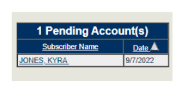
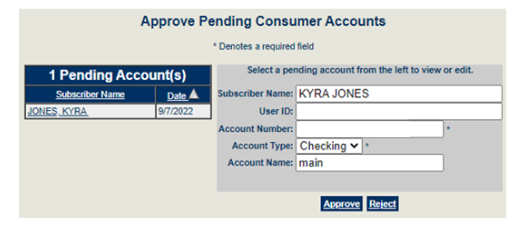
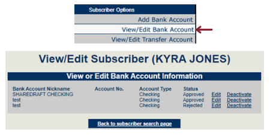

# Approving an Additional Bill Pay Account
## Table of Contents
[Overview](#overview)

[Instructions](#instructions)

## Overview
This document will explain how to approve an additional Bill Pay account. The member will first need to follow the steps in the [*Adding Second Bill Pay Account Instructions*](\additionalbpacct.md) instructional document. Once they have done so, we can continue with approving or rejecting the account.

---

## Instructions
1. First, log into the Bill Pay (Masters) system. On the left-hand side of the homepage, find the option that says *Pending Account* and click on it. If there aren’t any accounts to verify it will state that there is nothing pending. However, if there is something that is pending, it should look like the picture below.

2. Once you have found the member’s request, click on their name. It will open an area as seen in the figure below. You will need to check two things before you approve or deny it. 
    - Check to make sure that the account number is correct. We will accept either the member number plus suffix or the draft ID. 
    - Check to make sure that the member is on the account they are trying to add.
If both criteria are met, click *Approve*. If either of the criteria aren’t met, click *Reject* and have the corrections made before the member submits another request.

3. Once you have approved the account, verify that it is available by going to the member’s Bill Pay profile. When you are in the member’s profile, find the option on the left-hand side that says *View/Edit Bank Account*. Click on this to view the account numbers on this person’s record. A page with all the accounts will show up as seen in the figure below. These are all the accounts the member can use to make payments. 

>Something else to keep in mind is that “rejected” accounts also show up here. If you would like to delete them you may, but they will not show up on the member’s end so it’s optional to do so.

4. Once you have verified the account, it will be ready for use. The member will need to log out and back into Bill Pay to see it. If you have any further questions, reach out to e-services. 
